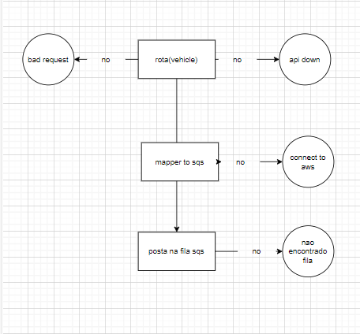

# infosistemas

This repository contains a modular system for vehicle CRUD processing, split into two main components:

- **Broker**: Responsible for handling incoming requests related to vehicle data retrieval. It acts as the entry point for the system, performing search and read operations directly from the database.
- **Dispatcher**: Dedicated to processing data changes, such as creating new vehicle records or updating existing ones. All insert and update operations are managed by the dispatcher, ensuring business rules and validations are applied before persisting changes.

This architecture separates read and write responsibilities, improving scalability, maintainability, and clarity in the codebase.

Within each main folder, you will find a `fluxo.drawio` file, which provides a flowchart diagram of the respective process.

For example:



Additionally, inside each folder you will also find another README file with more detailed information about the respective microservice.

---

## Running the Project with Docker Compose

To easily run the entire infrastructure (Broker, Dispatcher, Postgres, and a local SQS mock), use the provided `docker-compose.yml`:

1. Make sure you have [Docker](https://www.docker.com/) and [Docker Compose](https://docs.docker.com/compose/) installed.
2. Place a valid `Dockerfile` in both the `broker` and `dispatcher` folders.
3. In the project root, run:

   ```bash
   docker-compose up --build

   